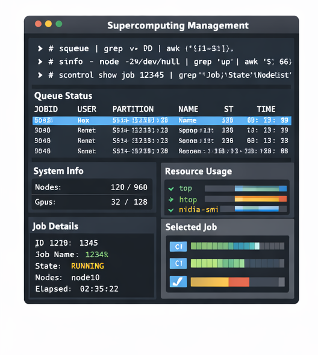
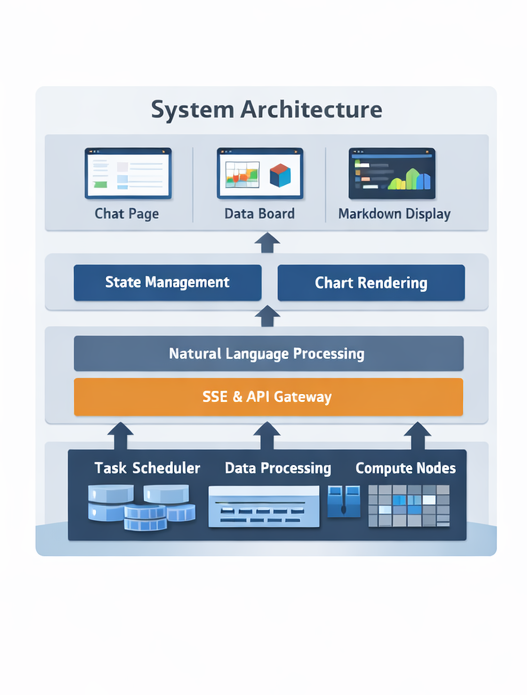
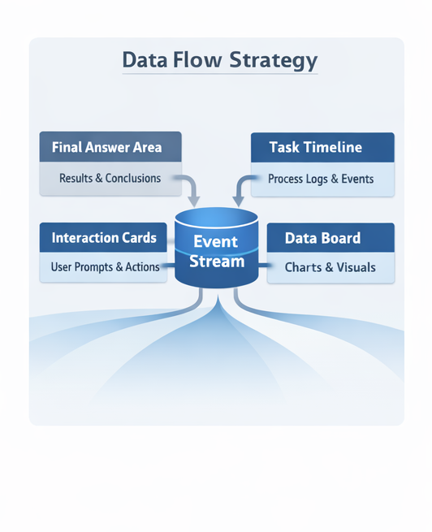
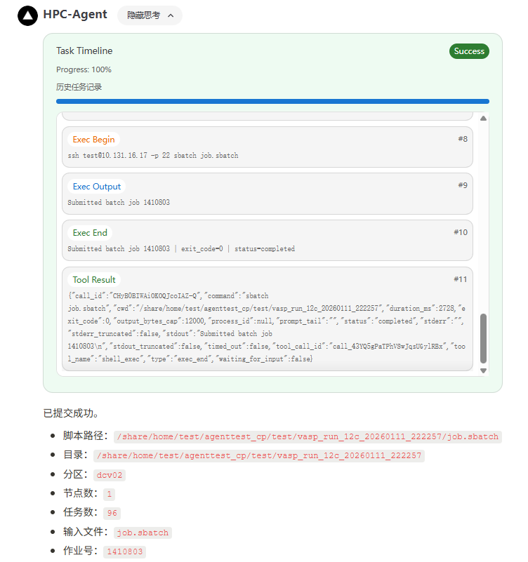
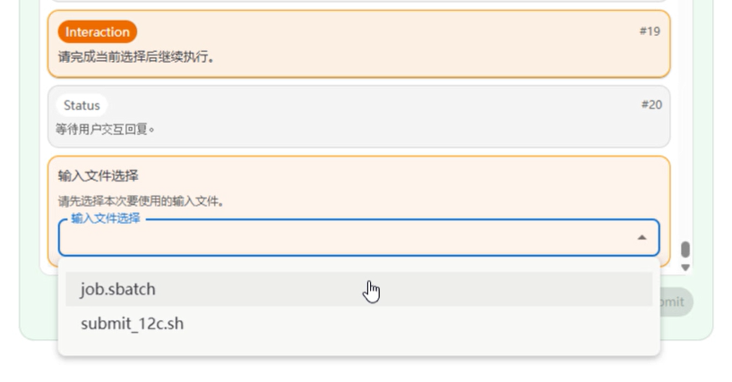
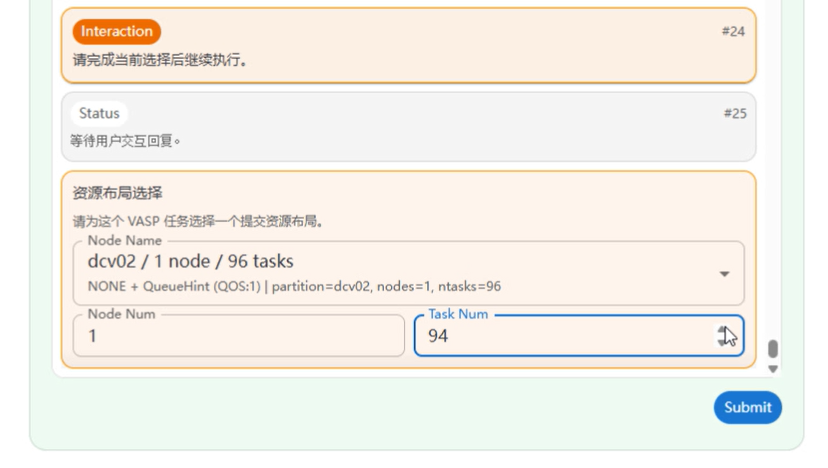
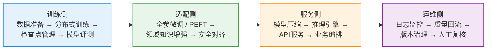

# 自然语言驱动超算使用过程的

# 交互设计与实现

  
<b>项目类型：</b>本科毕业设计 中期答辩

  
<b>项目摘要：</b>面向高性能计算平台运行管理场景的智能交互系统

  
<b>汇报人：</b>林沫非

  
<b>汇报日期：</b>2026-04-24

<!--
老师们好，我是计算机2206的林沫非。

今天汇报的题目是：
“自然语言驱动超算使用过程的交互设计与实现”。

本项目面向高性能计算平台的运行管理场景，
通过自然语言交互、智能体以及可视化技术，
实现运行数据的自动分析与展示，是一个偏工程实现和系统落地的项目。
-->

---
transition: fade-out
layout: quote
background: ./img/back-right.png
---

# 目录

- 研究背景与课题目标
- 系统设计与技术方案
- 系统展示与实现效果
- 下一步计划

<!--
本次汇报主要分为这四个部分：

首先介绍研究背景和课题目标，
然后说明系统设计与技术方案，
接着展示当前已经完成的功能和效果，
最后介绍下一步的工作计划。
-->

---
layout: section
---

# 研究背景与课题目标

<!--
首先是研究背景与课题目标
-->

---
layout: two-cols
---

# 研究背景
KeyPoint：信息分散 高门槛

### 超算运行场景的典型问题 
- 使用门槛高。用户有使用需求时，往往需要掌握比较多的基础知识
  > 比如Linux命令、调度器等，这使得一些需求的实现需要花费更多的时间和精力来熟悉超算操作
- 平台运行数据复杂，普通用户难以快速统计所需信息
  > 例如作业运行状态、资源占用、历史结果往往分散在不同指令中
- 数据查询、统计分析和可视化通常依赖脚本或固定页面，灵活性不足
  > 用户如果想临时提出一个新的分析问题，往往无法直接通过现有页面完成

::right::

  

<!--
在超算运行使用场景中，
需要掌握的基础知识比较多，比如linux基础命令、slurm调度器，
海量信息分散在不同的指令中，很多分析工作依赖脚本、命令行或者固定页面来完成。

这对非资深用户来说门槛较高，也会影响整体使用效率。

所以这个课题要解决的问题是，如何让用户更自然、更低门槛地使用超算
-->

---

# 课题目标
KeyPoint：AG-UI（Agentic UI） 交互 可视化任务流

课题定位：**一个面向超算运行数据分析与可视化的自然语言交互系统。**

课题目标：实现用户与系统之间的协作关系

AG-UI（Agentic UI）交互范式：围绕智能体设计用户界面，系统主动理解目标、规划步骤并执行任务
- 降低超算使用门槛，让用户以自然语言方式描述使用需求
  > 用户不需要先学习 Shell、Slurm 调度器 和 平台使用方法
- 系统根据用户需要，自动完成数据查询、统计分析和可视化展示
  > 将“理解问题—调用能力—返回结果”这一过程自动化
- 将智能体执行过程转化为可交互、可追踪的前端任务流程
  > 用户能够与任务流进行交互，提升使用体验

<!--
这个课题的核心目标是让用户通过用自然语言描述需求来完成一些超算操作

比如超算系统的数据查询、分析和可视化

其中

我主要负责前端交互的部分

我的目标是，通过Agentic UI的交互范式，围绕智能体来设计用户界面，强调系统主动理解目标、规划步骤并执行任务
从而实现用户与系统之间的协作关系，提升用户使用体验
-->

---
layout: section
---

# 系统设计与技术方案

<!--
接下来的章节我会介绍这个系统的总体设计与技术方案
-->

---
layout: two-cols
transition: none
---

# 技术栈与系统设计

### 系统分层
1. 页面层：登录页、聊天页、Data Board
   > 负责用户可见界面的组织与切换
2. 状态层：聊天、任务、图表、鉴权状态
   > 统一管理会话过程中的前端状态
3. 协议层：SSE 事件解析、交互 prompt、图表解析
   > 负责把后端流式消息转成可消费的结构化事件
4. 展示层：Markdown、任务卡片、时间线、交互卡片、图表卡片
   > 将不同类型的信息映射到不同的前端组件中

::right::

  

<!--
首先整体架构的分为页面层、状态层、协议层和展示层，
-->

---
layout: two-cols
---

# 技术栈与系统设计

### 系统分层
1. 页面层：登录页、聊天页、Data Board
   > 负责用户可见界面的组织与切换
2. 状态层：聊天、任务、图表、鉴权状态
   > 统一管理会话过程中的前端状态
3. 协议层：SSE 事件解析、交互 prompt、图表解析
   > 负责把后端流式消息转成可消费的结构化事件
4. 展示层：Markdown、任务卡片、时间线、交互卡片、图表卡片
   > 将不同类型的信息映射到不同的前端组件中

::right::

 

 

### 技术栈

| 类别 | 技术方案 |
|---|---|
| 前端框架 | Next.js 15 + React 19 |
| 语言 | TypeScript |
| UI 组件 | MUI |
| 状态管理 | Zustand |
| 流式协议 | `@microsoft/fetch-event-source` |
| 图表渲染 | Vega-Lite / vega-embed |
| 部署方式 | 静态导出 + Nginx |

<!--
前端基于 Next.js 和 React 构建，
通过 SSE 来承载智能体的流式执行过程。
-->

---
layout: two-cols
transition: none
---

# 流式协议设计

### 实现 Agentic UI

让 agent 后端和前端通过一套标准化事件流实时通信，把消息、工具调用、状态更新、生命周期事件等持续同步到界面

### 前端分流策略

- 最终回答：进入答案区
> 保证用户能快速找到结论
- 过程日志：进入任务时间线
> 展示任务推进过程与关键节点
- 用户交互：进入交互卡片
> 便于用户直接确认、选择或补充参数
- 图表结果：进入 Data Board
> 集中展示可视化结果

::right::

  

<!--
我的工作是实现项目中一整套AG-UI的流程

这也是这个系统前端和传统聊天页面相比，一个比较关键的区别。

其中协议设计和分流是它的一个关键设计点。

前端不会简单把后端所有输出都当作普通文本展示，
而是要根据语义进行分流，让最终回答、过程日志、用户交互和图表结果，
分别进入合适的展示区域。
-->

---
layout: two-cols
---

# 流式协议设计

### 实现AG-UI

让 agent 后端和前端通过一套标准化事件流实时通信，把消息、工具调用、状态更新、生命周期事件等持续同步到界面

### 前端分流策略

- 最终回答：进入答案区
> 保证用户能快速找到结论
- 过程日志：进入任务时间线
> 展示任务推进过程与关键节点
- 用户交互：进入交互卡片
> 便于用户直接确认、选择或补充参数
- 图表结果：进入 Data Board
> 集中展示可视化结果

::right::

 

 

### 核心事件

- `chat_begin`：一次对话任务开始
- `status`：表示当前阶段性状态更新
- `call`：系统向用户发起确认或补充信息请求
- `delta`：流式追加最终回答内容
- `message`：完整回答收束
- `tool_call`：智能体调用外部工具或能力
- `tool_result`：工具返回结果
- `exec_begin`：某段执行过程开始
- `exec_output_delta`：执行输出实时追加
- `exec_error`：执行异常信息
- `exec_end`：执行结束
- `chat_error`：对话级别错误

<!--
我设计了一套应用层事件协议，将智能体的规划与执行过程结构化为一系列事件，并通过流式方式推送到前端进行展示
-->

---
layout: section
---

# 系统展示与实现效果

<!--
接下来是当前成果的展示
-->

---
layout: two-cols
---

# 总体任务流效果

演示场景：用户输入“帮我提交 agenttest 目录下任务”

### 展示内容
- 自然语言输入
  > 用户直接以任务目标来表达需求
- 智能体规划与执行
  > 后端根据目标拆分步骤并选择合适能力
- 前端展示任务卡片与时间线
  > 将执行过程实时反馈给用户
- 用户参与关键决策
  > 例如文件选择、资源配置确认等
- 最终得到结果
  > 给出任务提交反馈与状态结果

::right::

  <video
    src="./video/total.mp4"
    autoplay
    muted
    loop
    class="w-full object-cover bg-transparent outline-none"
  ></video>

<!--
这里展示的是一个完整的任务流示例。

用户输入自然语言后，

智能体会先理解任务目标，然后进行规划执行，按照协议规范实时向前端推送数据流

前端根据分流策略将数据分发到不同的组件，实时展示任务推进过程

在关键步骤，系统会请求用户确认或补充参数，
用户完成交互之后，任务继续推进，最终得到结果。

接下来，我会分别展开说明聊天、交互和图表这三个关键机制。
-->

---
layout: two-cols
---

# 聊天系统与任务卡片
Agentic UI 实现

### 展示机制
- 支持多轮对话与流式渲染
  > 用户可以连续提出问题，系统逐步返回内容
- 执行过程抽象为任务卡片
  > 将后端行为转成更易理解的前端表达
- 展示状态、进度和日志
  > 让用户知道任务进行到哪一步、当前在做什么
- 最终结果高亮展示
  > 将结果与过程区分开，提升可读性

 

### 历史任务回放
- 可视化历史任务执行过程，恢复任务时间线
  > 用户后续可以回看任务执行的脉络

::right::

    

<!--
关于聊天系统，有两个重点

第一，聊天本身是流式的，响应会实时展示；
第二，执行过程被抽象成任务卡片，
用户可以直观地看到每一步的状态和日志。

另外，系统也支持历史任务回放，用户可以回看之前任务的执行过程。
-->

---
layout: two-cols
---

# 交互式任务流
Agentic UI 实现

### 用户参与决策
- 表单交互：适合补充参数、填写任务信息
- 文件选择：在多个候选输入之间进行确认
- 参数选择：资源配置、节点数等运行参数
- 混合输入：同时支持文本输入与选项选择

 

### 交互价值：协作式执行任务
- 将关键决策节点交还给用户
  > 避免系统在不确定情况下直接替用户做决定
- 保留推荐能力，同时允许人工修正
  > 用户可以接受推荐，也可以自行调整
- 形成“系统规划 + 用户确认”的协作闭环
  > 兼顾自动化程度与可控性

::right::

    
  

<!--
关于交互这块，

重点在于系统不是单向问答，而是协作式执行。

智能体会分析任务过程中的关键步骤，
并在这些节点请求用户确认或补充信息。

比如在这个示例里，
系统会在选择可执行文件、设置资源配置等环节发起交互，
同时给出一些推荐选项。

用户可以直接采用推荐，也可以自己调整。

系统把关键决策保留给了用户，
形成了一个完整的协作闭环。
-->

---
layout: two-cols
---

# 图表展示交互
Agentic UI 实现

### Data Board 面板
- 识别 Vega-Lite 并进行展示
  > 智能体返回结构化图表后，前端自动渲染
- 支持“chat with data”
  > 用户可以基于当前图表继续提问和分析
- 自动包装图表上下文发送给智能体
  > 减少用户重复描述上下文的成本

 

### 当前价值
- 将结果从文本扩展为图表表达
  > 更适合展示趋势、对比、分布等分析结果
- 支持围绕图表继续交互
  > 图表不只是终点，也可以成为下一轮分析的起点

::right::

  <video
    src="./video/chart_end.mp4"
    autoplay
    muted
    loop
    class="w-full object-cover bg-transparent outline-none"
  ></video>

<!--
在可视化方面，
系统可以识别智能体返回的 Vega-Lite 结果，并在 Data Board 中自动展示。

同时，用户还可以围绕当前图表继续发起交互，
系统会自动把图表相关上下文一起打包发送给智能体，
从而支持“基于图表继续分析”这样的chat with data的使用方式。
-->

---

# 总结

### 目前进展

 

- 自然语言分析入口
  > 用户可以直接通过自然语言发起分析任务

 

- 统一交互界面
  > 聊天、任务、交互和图表被整合到同一套界面中

 

- 任务流执行闭环
  > 从输入、规划、交互到结果展示已经基本打通

<!--
总结来说，
目前系统已经从一个简单的想法，
逐步落成了一个可以实际演示的原型系统。

它已经具备自然语言入口、统一交互界面、任务执行闭环，
以及初步的工程化部署能力。
-->

---
layout: section
---

# 下一步计划

<!--
最后一个章节是本次答辩后下一步工作计划的说明
-->

---

# 下一步计划

### 后续工作方向

 

- 提升自然语言分析流程与AG-UI的匹配程度
  > 提升复杂场景下的理解能力与交互稳定性

 

- 优化任务展示与交互体验
  > 让任务状态、进度和用户操作更加清晰

 

- 增强图表与可视化能力
  > 支持更丰富的展示形式和更自然的图表交互

 

- 准备论文与答辩材料
  > 梳理系统设计、实现过程和创新点

<!--
接下来，我们打算主要围绕功能完善、体验优化和工程稳定性这三点推进。

一方面继续提升交互能力，
另一方面完善可视化和工程化部分。

最后，也会同步推进论文撰写和答辩材料准备。
-->

---
layout: cover
class: text-center title-end
---

# 感谢聆听

 

### 欢迎老师批评指正

<!--
我的汇报到这里结束，谢谢各位老师的聆听。
也欢迎各位老师批评指正。

我的贡献点在于
第一是 设计了一套基于 Agentic UI 的事件流交互机制，将消息输出、工具调用、状态更新以及任务生命周期等信息进行结构化表达，实现前后端的流式通信与任务过程可视化
第二是 完成了系统前端的工程实现，将这一交互模式实际落地，才有了刚才我演示的HPC聊天网站

研究意义
简单来说，我所在的团队在做“范式改变”，而其中我在做“交互落地”

团队层面：我们在探索一种基于自然语言驱动的超算操作范式，将传统依赖命令行和脚本的复杂操作转化为语义化交互，从而降低使用门槛，提升系统的易用性。

个人层面：我主要负责前端交互部分，基于 AG-UI 设计并实现了任务流程可视化界面，将智能体的规划与执行过程结构化展示，并支持用户在关键节点参与决策，实现人机协同的交互闭环，从而提升系统的可解释性和交互体验。

-->

---

<!-- 模型图 -->
