# 自然语言驱动超算使用过程的
# 交互设计与实现

  
<b>答辩类型：</b>本科毕业设计结期答辩

  
<b>项目方向：</b>面向超算运行管理场景的自然语言智能交互系统

  
<b>汇报人：</b>林沫非

  
<b>指导教师：</b>戴慧珺

  
<b>汇报日期：</b>2026-06-01

<!--
各位老师好，我是计算机2206的林沫非。

今天我将汇报的毕业设计题目是“自然语言驱动超算使用过程的交互设计与实现”。

本项目探索一种基于自然语言与智能体的超算交互新范式，
将传统以命令行为主的使用方式，
转变为人机协同的任务驱动交互。

在此基础上，系统实现了工作流的可视化展示，
并完成完整的工程化落地。
-->

---
layout: quote
background: ./img/back-right.png
transition: fade-out
---

# 汇报内容

- 课题背景与研究目标
- 系统方案与关键设计
- 个人工作与实现结果
- 测试分析与总结展望

<!--
这次汇报主要分为四个部分。

首先介绍课题背景和研究目标，
然后说明系统方案与关键设计，
接着我将重点汇报我负责的前端交互实现的工作，
最后给出分析结果与总结。
-->

---
layout: section
---

# 课题背景与研究目标

---
layout: two-cols
transition: none
---

# 研究背景
KeyPoint：信息分散 高门槛

 

### 超算运行场景的典型问题 

- 使用门槛高。用户往往需要掌握较多基础知识
  > 比如Linux命令、调度器等，这使得一些需求的实现需要花费更多的时间和精力来熟悉超算操作
- 平台运行数据复杂，普通用户难以快速统计所需信息
  > 例如作业运行状态、资源占用、历史结果往往分散在不同指令中
- 数据查询、统计分析和可视化通常依赖脚本或固定页面，灵活性不足
  > 用户如果想临时提出一个新的分析问题，往往无法直接通过现有页面完成

::right::

  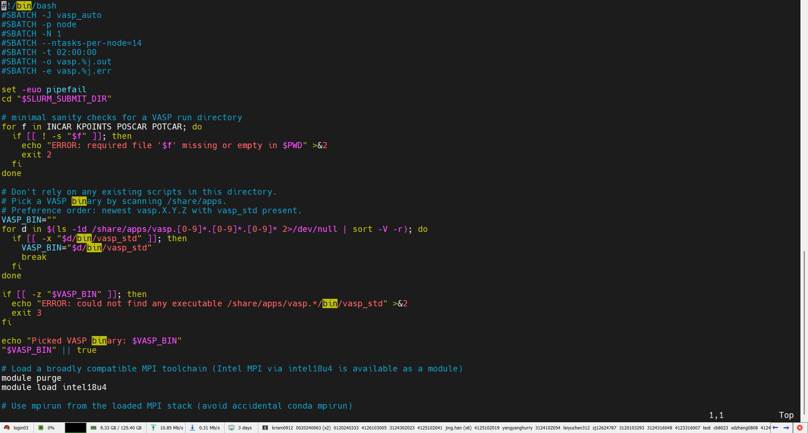
  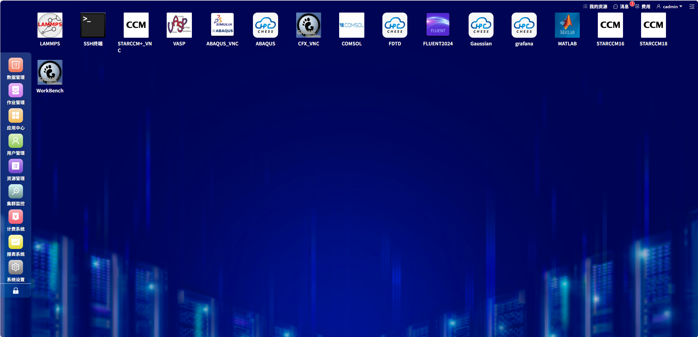

<!--
在超算运行使用场景中，
需要掌握的基础知识比较多，比如linux基础命令、slurm调度器，
海量信息分散在不同的指令中，很多分析工作依赖脚本、命令行或者固定页面来完成。

这对非资深用户来说门槛较高，也会影响整体使用效率。
-->

---
layout: two-cols
---

# 研究背景
KeyPoint：信息分散 高门槛

 

### 问题本质

- 如何把“表达需求”和“完成任务”之间的距离缩短，让用户更自然、更低门槛地使用超算

- 将使用门槛从“会不会使用超算指令”转变为“能不能表达需求”

::right::

  
  

<!--
所以这个课题要解决的问题是，如何让用户更自然、更低门槛地使用超算

把“表达需求”和“完成任务”之间的距离缩短，将使用门槛从“会不会使用超算指令”转变为“能不能表达需求”
-->

---

# 课题目标与我的工作定位
KeyPoint：AG-UI（Agentic UI） 交互 可视化任务流

课题目标：**构建一个面向超算运行管理场景的自然语言交互系统**

工作定位：实现用户与系统之间的协作关系

- 团队层面：探索“自然语言驱动超算使用”的新范式
- 我的重点：完成这一范式的**交互落地**

核心思路：以 **Agentic UI** 为交互范式，围绕智能体设计用户界面，使系统能够理解用户目标、规划步骤并执行任务，同时让用户在关键节点保持监督和控制权。

> Agentic UI：一种面向 AI Agent 的交互界面/产品形态

 

<!--
这个课题的核心目标是让用户通过用自然语言描述需求来完成一些超算操作

比如超算系统的数据查询、分析和可视化

其中

我主要负责前端交互的部分

我的目标是，通过Agentic UI的交互范式，围绕智能体来设计用户界面，强调系统主动理解目标、规划步骤并执行任务
从而实现用户与系统之间的协作关系，提升用户使用体验

简单来说，我所在的团队在做“范式改变”，而其中我在做“交互落地”

-->

---

# 课题意义
KeyPoint：降低门槛 人在回路

- 降低超算使用门槛，让用户以自然语言方式描述使用需求
  > 用户不需要先学习 Shell、Slurm 调度器 和 平台使用方法
- 系统根据用户需要，自动完成数据查询、统计分析和可视化展示
  > 将“理解问题—调用能力—返回结果”这一过程自动化
- 将智能体执行过程转化为可交互、可追踪的前端任务流程
  > 用户能够与任务流进行交互，提升使用体验

用户直接描述需求，系统自动完成：

- 任务理解与步骤规划
- 运行数据查询与统计分析
- 图表生成与结果展示
- 必要的人在回路确认

---
layout: section
---

# 系统方案与关键设计

---

# 系统总体架构

  

    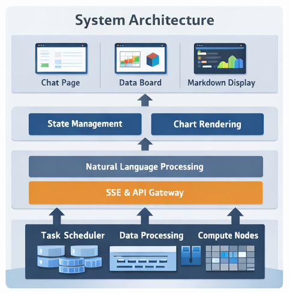
  

  

    
架构分层

    <ul>
      <li>底层资源层：任务调度、运行数据处理、计算节点</li>
      <li>智能体处理层：自然语言理解、任务规划、工具调用</li>
      <li>状态与渲染层：任务状态管理、图表渲染、结果组织</li>
      <li>前端交互层：聊天页面、任务卡片、Data Board、Markdown 展示</li>
    </ul>
    
设计重点

    <ul>
      <li>不是只返回答案，而是返回“过程 + 结果”</li>
      <li>不是单一聊天界面，而是任务流式交互界面</li>
      <li>让自然语言、执行日志、交互确认和图表结果协同出现</li>
    </ul>
  

<!--
系统整体可以分成四层。

- 底层是超算资源和运行数据，
- 上层是自然语言理解和智能体任务组织，
- 再往上是状态管理和图表渲染，
- 最终由前端界面承接交互

我的工作重点位于前端交互层，以及前后端之间的协议消费和状态组织。
-->

---
layout: two-cols
---

# 流式协议设计

### Agentic UI：从问答到任务协作

Agentic UI 是一种面向 AI Agent 的交互界面设计方式：用户给出目标，智能体负责规划、调用工具和执行任务，前端负责展示过程、状态、确认和结果。

 

### 为什么不能只做普通聊天框

- 智能体执行过程包含规划、工具调用、日志输出、用户确认、图表生成等多类信息
- 如果全部压缩为线性文本，用户难以判断系统正在做什么
- 超算任务存在风险操作和缺失参数，需要明确的交互入口

 

### 设计目标

让用户始终知道系统正在做什么、下一步需要自己做什么，以及任务异常后可以从哪里恢复。

::right::

  
界面需要承接的过程信息

  <ul>
    <li>规划：系统如何拆解用户目标</li>
    <li>执行：当前正在调用什么工具、处理什么数据</li>
    <li>确认：哪些节点需要用户补充参数或批准</li>
    <li>结果：最终回答、图表和可继续分析的数据</li>
  </ul>
  

    因此，前端不能只把智能体输出当作一段文本渲染，而要把它组织成任务过程。
  

<!--
这里介绍 Agentic UI 作为一种交互设计范式。
它不是一个更好看的聊天框，而是围绕智能体执行过程设计的任务界面。
用户给出目标之后，智能体会进行规划、调用工具和执行任务；前端要把过程、状态、确认和结果组织出来。
所以这一页强调：界面要让用户看得见过程，也能在关键节点参与控制。
-->

---
layout: two-cols
---

# 流式协议设计

### 前端分流策略

- 最终回答：进入答案区
- 过程日志：进入任务时间线
- 用户交互：进入交互卡片
- 图表结果：进入 Data Board

 

### 分流依据

- 后端通过流式事件持续推送任务进展
- 前端按照事件语义更新不同界面区域
- 同一个智能体任务被组织为可观察的 UI 状态

::right::

  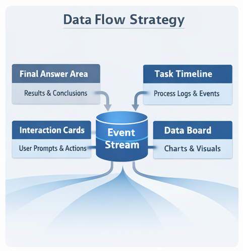

<!--
在具体实现上，我把流式事件按照语义进行分流：
结果去答案区，日志去时间线，确认信息进交互卡片，图表进 Data Board。
这样界面围绕智能体组织，而不是围绕单条文本组织。
-->

---

# 流式协议与任务状态设计

  

    
流式协议

    <ul>
      <li>接口：<code>POST /ai/chat/stream</code></li>
      <li>机制：基于 SSE 持续推送任务事件</li>
      <li>协议背景：AG-UI 是事件驱动的 Agent-User 通信协议</li>
      <li>核心事件：<code>chat_begin</code>、<code>status</code>、<code>tool_call</code>、<code>tool_result</code>、<code>delta</code>、<code>message</code>、<code>chart</code>、<code>chat_error</code></li>
      <li>人在回路：通过 <code>ask -&gt; resume</code> 实现暂停与恢复</li>
    </ul>
    
任务状态

    <ul>
      <li><code>waiting_user</code></li>
      <li><code>pending</code></li>
      <li><code>running</code></li>
      <li><code>success</code></li>
      <li><code>fail</code></li>
      <li><code>cancelled</code></li>
    </ul>
  

  

    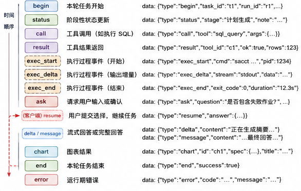
    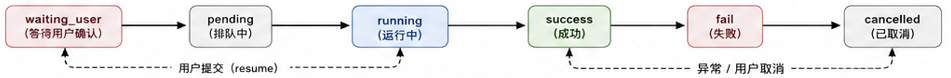
  

<!--
前后端协作的核心，是用 SSE 持续同步智能体任务过程。
从协议思想上看，AG-UI 提供的是 Agent 后端和用户前端之间的事件驱动通信思路。
在我的实现中，后端通过 SSE 推送自定义任务事件，前端再把这些事件映射到答案区、任务时间线、交互卡片和 Data Board。
SSE 负责把事件按时间推给前端，状态机负责把这些事件归并成 waiting_user、running、success 等任务状态。
这样一来，不管是查询任务、作业提交还是图表生成，前端都可以用一致的方式展示和恢复。
-->

---
layout: section
---

# 个人工作与实现结果

---

# 我负责的前端交互落地

  

    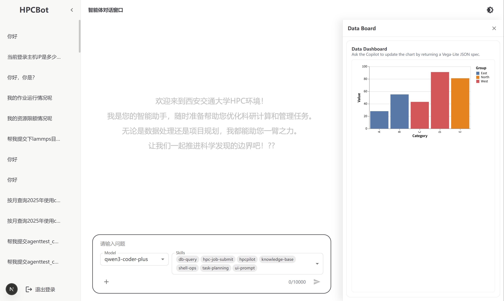
  

  

    
界面组织

    <ul>
      <li>登录页：仿照 SSH 远程连接方式，输入 IP、账户、密码、端口</li>
      <li>左侧折叠栏：历史记录与会话切换</li>
      <li>下方输入区：自然语言输入、模型选择、技能选择</li>
      <li>中间区域：文本回答 + 任务卡片 + 过程时间线</li>
      <li>右侧折叠栏：Data Board，集中渲染图表</li>
    </ul>
    
我完成的关键工作

    <ul>
      <li>事件协议消费与分流</li>
      <li>任务卡片与交互卡片设计</li>
      <li>任务状态管理与历史恢复</li>
      <li>图表入口与 Data Board 联动</li>
    </ul>
  

<!--
这一页对应我最核心的工作。
我负责把智能体过程变成一个可用的前端工作区：
左边看历史，中间看任务流，下面发起请求，右边查看图表。
整个界面是围绕智能体任务协作来设计的。
-->

---

# 前端组件与状态流

  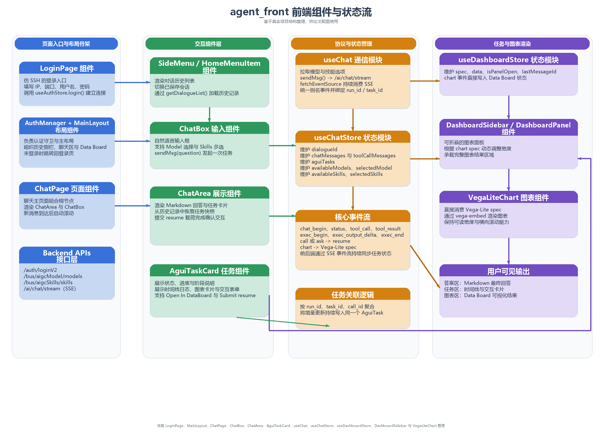

  这张图对应我在 <code>agent_front</code> 中完成的真实实现结构：页面与布局组件组织工作区，<code>useChat</code> 和状态仓库负责消费 SSE 事件并维护任务状态，任务卡片与图表组件负责把过程日志、交互请求和可视化结果渲染到界面中。

<!--
这一页不是概念图，而是基于真实前端项目整理出来的组件和状态流。
它体现的是：页面、状态、协议、图表渲染之间是如何协同工作的。
这也是我在工程实现中最有代表性的部分。
-->

---
layout: two-cols
---

# 典型场景一：自然语言查询与图表展示

### 示例任务

“查询 2025 年 CPU 机时使用情况，并绘制趋势图”

### 实现过程

- 用户以自然语言发起请求
- 智能体规划查询步骤并执行统计
- 后端通过 <code>chart</code> 事件直接返回 Vega-Lite 图表 JSON
- 前端将图表写入任务卡片并同步到 Data Board

### 结果特点

- 结论与过程同时可见
- 图表规范结构化、可复用
- 图表显示不依赖前端手写每一种图形逻辑

::right::

  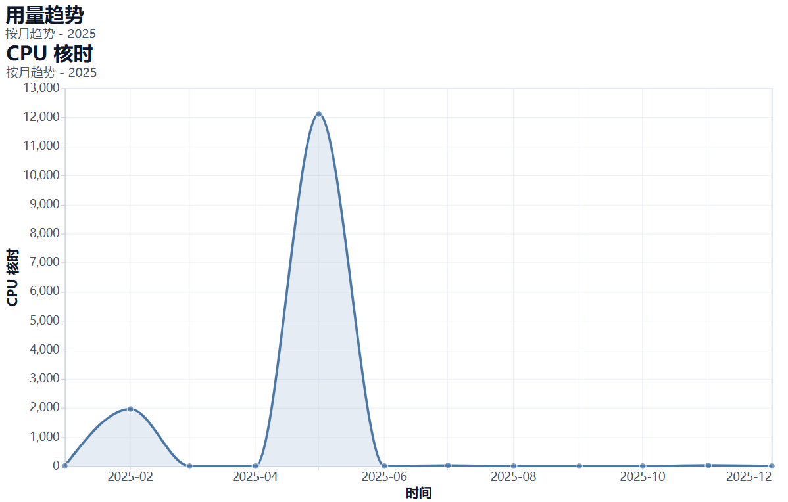

<!--
这个场景体现的是运行数据分析闭环。
用户提出自然语言问题后，系统不仅返回文字结论，还返回结构化图表。
这里需要强调，图表不是前端从文本里猜出来的，而是后端通过 chart 事件按约定直接返回 Vega-Lite 规范。
-->

---
layout: two-cols
---

# 典型场景二：人在回路的任务提交

### 示例任务

“帮我提交某目录下的任务”

### 过程特点

- 系统识别这是带风险的操作，不直接替用户完成
- 对缺失参数和关键资源进行确认
- 通过交互卡片暂停任务，等待用户输入
- 用户提交后，通过 <code>resume</code> 恢复原有上下文继续执行

### 价值

- 保留自然语言交互的便利性
- 避免高风险场景下系统“自作主张”
- 提升过程透明度与可控性

::right::

  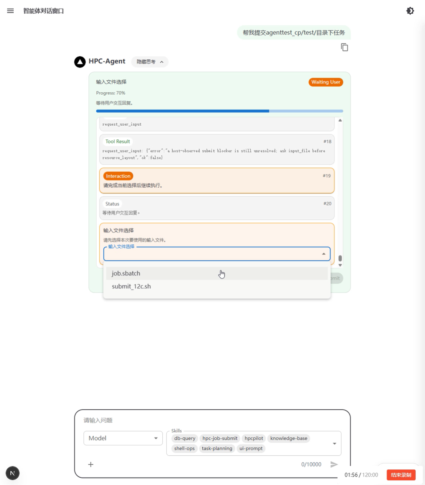
  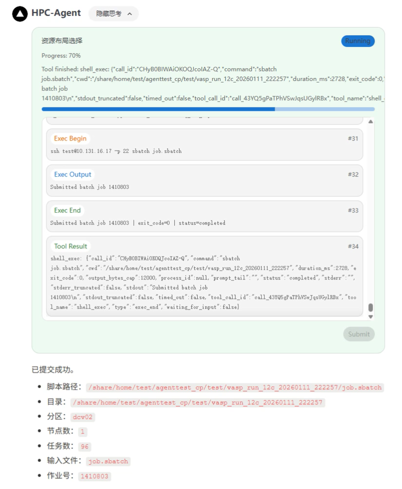

<!--
这个场景体现的是 ask 到 resume 的闭环。
对于作业提交这类风险操作，系统不会直接执行到底，而是在关键节点停下来，请用户确认文件、资源参数等信息。
这样智能体是主动的，但控制权仍然在用户手中。
-->

---

# 新增能力：围绕图表继续追问

  

    
实现方式

    <ul>
      <li>前端引入 CopilotKit</li>
      <li>自动包装当前图表规范、图表上下文和会话摘要</li>
      <li>用户可继续用自然语言描述修改需求</li>
      <li>系统返回新的 Vega-Lite 规范并重新渲染</li>
    </ul>
    
支持的追问类型

    <ul>
      <li>修改图表类型，如折线图改为柱状图</li>
      <li>调整筛选范围、时间粒度或分组维度</li>
      <li>围绕当前结果继续分析和解释</li>
    </ul>
    
意义

    

      Data Board 不再是静态展示区域，而成为可持续交互的分析空间。
    

  

  

    
  

<!--
这是结期阶段最重要的一个新增点。
系统现在已经支持围绕图表继续追问，而不是只生成一张静态图。
通过 CopilotKit，当前图表上下文会被自动包装，用户可以继续用自然语言说“改成柱状图”“按队列分组”等，
系统再返回新的图表规范完成更新。
-->

---

# 测试与完成情况

  

    
已完成的主要能力

    <ul>
      <li>自然语言查询超算运行数据</li>
      <li>SSE 流式协议消费与前端事件分流</li>
      <li>任务时间线与状态流转展示</li>
      <li>人在回路交互卡片与 <code>ask -&gt; resume</code> 协议</li>
      <li>Vega-Lite 图表渲染与 Data Board</li>
      <li>围绕图表继续追问与修改</li>
      <li>历史任务恢复与图表入口恢复</li>
    </ul>
  

  

    
结题结果

    <ul>
      <li>完成论文撰写与整体系统整理</li>
      <li>形成统一的前后端事件协议与状态模型</li>
      <li>完成多个典型场景验证：查询、提交、恢复、图表追问</li>
      <li>实现从“自然语言描述”到“结果展示与继续分析”的闭环</li>
    </ul>
    
仍可继续完善的方向

    <ul>
      <li>更强的后端状态图固化与权限控制</li>
      <li>多图联动、图表版本管理、异常点标注</li>
      <li>更系统的用户评估与对比实验</li>
    </ul>
  

<!--
从结题角度看，系统已经完成了比较完整的功能闭环。
特别是协议分流、人在回路、图表展示和图表继续追问这几部分，已经形成了能够演示、能够写入论文、也能够支持后续扩展的基础。
-->

---

# 总结

### 本文工作的核心价值

- 面向超算场景，探索了自然语言驱动的交互新方式
- 以 Agentic UI 为核心，完成了智能体过程到前端界面的交互落地
- 实现了任务过程可视化、人在回路确认、图表展示与图表继续追问

### 我的主要贡献

- 设计并实现前端工作区与核心交互范式
- 完成 SSE 事件协议消费、任务状态管理与前端分流方案
- 实现任务卡片、交互卡片、Data Board 与图表上下文交互能力
- 整理系统材料并完成论文撰写

### 一句话概括

我所做的工作，是把“自然语言驱动超算使用”的想法，真正落实为一个可交互、可观察、可持续扩展的前端系统。

<!--
最后总结一下。
这个课题从整体上是在探索一种新的超算交互范式，
而我负责的是把这套范式真正落到界面和系统实现上。
也就是让智能体不只是在后台工作，而是成为用户能够看见、能够协作的前端任务流。
-->

---
layout: center
class: text-center
---

# 谢谢各位老师

### 请批评指正
