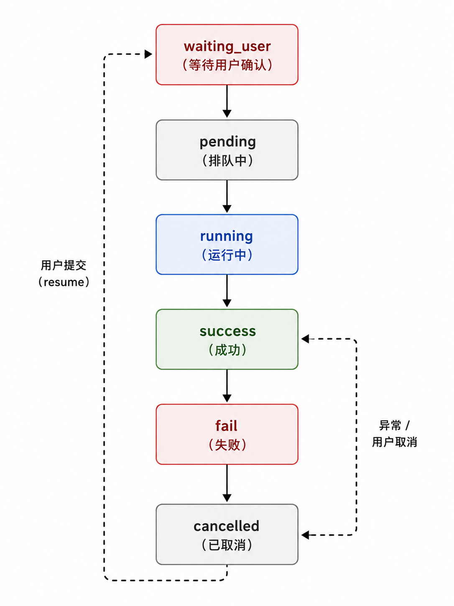
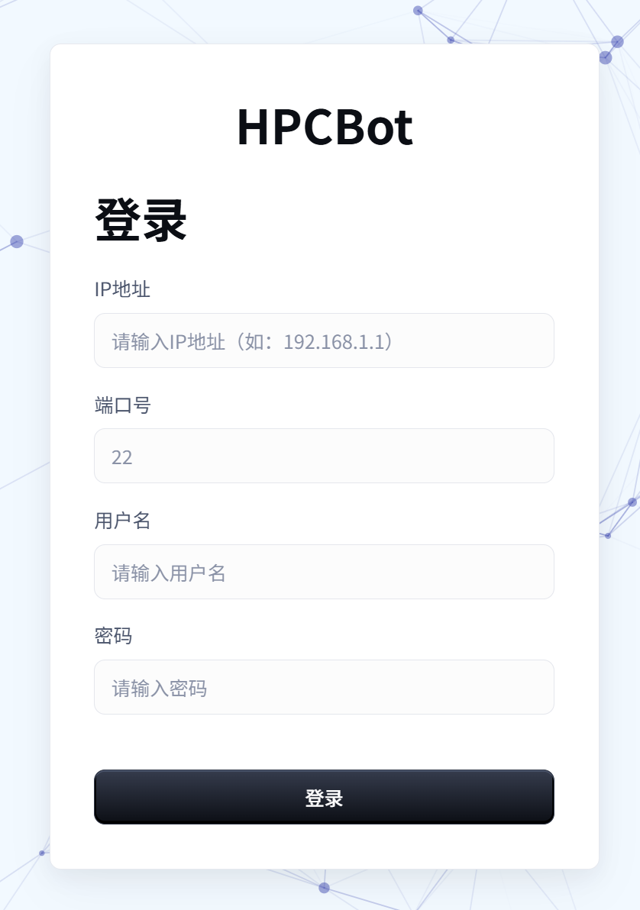

# 自然语言驱动超算使用过程的
# 交互设计与实现

  
<b>答辩类型：</b>本科毕业设计结期答辩

  
<b>项目方向：</b>面向超算运行管理场景的自然语言智能交互系统

  
<b>汇报人：</b>林沫非

  
<b>指导教师：</b>戴慧珺

  
<b>汇报日期：</b>2026-06-01

<!--
各位老师好，我是计算机2206的林沫非。

今天我将汇报的毕业设计题目是“自然语言驱动超算使用过程的交互设计与实现”。

本项目探索一种基于自然语言与智能体的超算交互新范式，
将传统以命令行为主的使用方式，
转变为人机协同的任务驱动交互。

在此基础上，系统实现了工作流的可视化展示，
并完成完整的工程化落地。
-->

---
layout: quote
background: ./img/back-right.png
transition: fade-out
---

# 汇报内容

- 课题背景与研究目标
- 系统方案与关键设计
- 工作展示与实现结果
- 测试分析与总结展望

<!--
这次汇报主要分为四个部分。

首先介绍课题背景和研究目标，
然后说明系统方案与关键设计，
接着我将重点汇报我负责的前端交互实现的工作，
最后给出分析结果与总结。
-->

---
layout: section
---

# 课题背景与研究目标

---
layout: two-cols
transition: none
---

# 研究背景
KeyPoint：信息分散 高门槛

 

### 超算运行场景的典型问题 

- 使用门槛高。用户往往需要掌握较多基础知识
  > 比如Linux命令、调度器等，这使得一些需求的实现需要花费更多的时间和精力来熟悉超算操作
- 平台运行数据复杂，普通用户难以快速统计所需信息
  > 例如作业运行状态、资源占用、历史结果往往分散在不同指令中
- 数据查询、统计分析和可视化通常依赖脚本或固定页面，灵活性不足
  > 用户如果想临时提出一个新的分析问题，往往无法直接通过现有页面完成

::right::

  
  

<!--
在超算运行使用场景中，
需要掌握的基础知识比较多，比如linux基础命令、slurm调度器，
海量信息分散在不同的指令中，很多分析工作依赖脚本、命令行或者固定页面来完成。

这对非资深用户来说门槛较高，也会影响整体使用效率。
-->

---
layout: two-cols
---

# 研究背景
KeyPoint：信息分散 高门槛

 

### 问题本质

- 如何把“表达需求”和“完成任务”之间的距离缩短，让用户更自然、更低门槛地使用超算

- 将使用门槛从“会不会使用超算指令”转变为“能不能表达需求”

::right::

  
  

<!--
所以这个课题要解决的问题是，如何让用户更自然、更低门槛地使用超算

-->

---

# 课题目标与我的工作定位
KeyPoint：AG-UI（Agentic UI） 交互 可视化任务流

课题目标：**构建一个面向超算运行管理场景的自然语言交互系统**

工作定位：实现用户与系统之间的协作关系

- 团队层面：探索“自然语言驱动超算使用”的**范式改变**
- 我的重点：完成这一范式的**交互落地**

核心思路：以 **Agentic UI** 为交互范式，围绕智能体设计用户界面，使系统能够理解用户目标、规划步骤并执行任务，同时让用户在关键节点保持监督和控制权。

> Agentic UI：一种面向 AI Agent 的交互界面/产品形态

 

<!--
这个课题的核心目标是让用户通过用自然语言描述需求来完成一些超算操作

比如超算系统的数据查询、分析和可视化

其中

我主要负责前端交互的部分

我的目标是，通过Agentic UI的交互范式，围绕智能体来设计用户界面，强调系统主动理解目标、规划步骤并执行任务
从而实现用户与系统之间的协作关系，提升用户使用体验

-->

---

# 课题意义
KeyPoint：降低门槛 人在回路

- 降低超算使用门槛，让用户以自然语言方式描述使用需求
  > 用户不需要先学习 Shell、Slurm 调度器 和 平台使用方法
- 系统根据用户需要，自动完成数据查询、统计分析和可视化展示
  > 将“理解问题—调用能力—返回结果”这一过程自动化
- 提升过程透明度，将智能体执行过程转化为可交互、可追踪的前端任务流程
  > 用户能够与任务流进行交互，提升使用体验
- 保留人在回路控制
  > 在参数缺失、风险操作等关键节点请求用户确认，保持用户的监督和控制权

<!-- 
课题意义简单来说

就是把“表达需求”和“完成任务”之间的距离缩短，将使用门槛从“会操作”转换为“会表达”
 -->

---
layout: section
---

# 系统方案与关键设计

<!--
接下来的章节我会介绍这个系统的总体设计与技术方案
-->

---
layout: two-cols
transition: none
---

# 系统总体架构与技术栈

### 架构分层
1. 前端交互层：聊天页面、任务卡片、Data Board、Markdown 展示
   > 负责用户可见界面的组织与切换，将不同类型的信息映射到不同的前端组件中
2. 状态层：任务状态管理、图表渲染、结果组织
   > 统一管理会话过程中的前端状态
3. 协议层：SSE 事件解析、交互 prompt、图表解析
   > 负责把后端智能体发送来的流式消息转成可消费的结构化事件
4. 资源层：任务调度、运行数据处理、计算节点
   > 超算平台拥有的各项资源

::right::

  

<!--
整体架构的分为前端交互层、状态层、协议层和资源层，

- 底层是超算资源和运行数据，智能体理解自然语言，根据资源层的信息组织任务
- 上层是协议层，解析后端发来的流式消息
- 再往上是状态管理和图表渲染，
- 最终由前端界面承接交互

-->

---
layout: two-cols
---

# 系统总体架构与技术栈

### 架构分层
1. 前端交互层：聊天页面、任务卡片、Data Board、Markdown 展示
   > 负责用户可见界面的组织与切换，将不同类型的信息映射到不同的前端组件中
2. 状态层：任务状态管理、图表渲染、结果组织
   > 统一管理会话过程中的前端状态
3. 协议层：SSE 事件解析、交互 prompt、图表解析
   > 负责把后端智能体发送来的流式消息转成可消费的结构化事件
4. 资源层：任务调度、运行数据处理、计算节点
   > 超算平台拥有的各项资源

::right::

 

 

### 技术栈

| 类别 | 技术方案 |
|---|---|
| 前端框架 | Next.js 15 + React 19 |
| 语言 | TypeScript |
| UI 组件 | MUI |
| 状态管理 | Zustand |
| 流式协议 | `@microsoft/fetch-event-source` |
| 图表渲染 | Vega-Lite / vega-embed |
| 部署方式 | 静态导出 + Nginx |

<!--
我的工作重点有两个
一个是前后端之间的协议消费和状态组织的设计，通过 SSE 来承载智能体的流式执行过程
另一个是前端交互层的落地实现，基于 Next.js 和 React 构建
-->

---
layout: two-cols
---

# 流式协议设计

### 设计目标

让用户始终知道系统正在做什么、下一步需要自己做什么，以及任务异常后可以从哪里恢复。

### 实现Agentic UI

Agentic UI 是一种面向 AI Agent 的交互界面设计方式：用户给出目标，智能体负责规划、调用工具和执行任务，前端负责展示过程、状态、确认和结果。

让 agent 后端和前端通过一套标准化事件流实时通信，把消息、工具调用、状态更新、生命周期事件等持续同步到界面

 

::right::

  

<!--
对于第一个重点流式协议设计

我的工作是实现项目中一整套Agentic-UI的流程

用户能看得见任务的整个过程，还能在关键节点参与控制

Agentic-UI这是这个系统前端和传统聊天页面相比，一个比较关键的区别。

其中，协议设计和分流是它的关键设计点。
-->

---
layout: two-cols
---

# 流式协议设计
AG-UI：事件驱动的 Agent-User 通信协议

### 核心事件

  

人在回路：通过 ask 与 resume 实现暂停与恢复

::right::

### 任务状态

  

<!--
协议方面

我设计了一套应用层事件协议，将智能体的规划与执行过程结构化为一系列事件，并通过流式方式推送到前端进行展示

其中，人在回路机制主要通过 ask 和 resume 事件来实现
-->
---
layout: two-cols
---

# 流式协议设计

### 前端分流策略

- 最终回答：进入答案区
> 保证用户能快速找到结论
- 过程日志：进入任务时间线
> 展示任务推进过程与关键节点
- 用户交互：进入交互卡片
> 便于用户直接确认、选择或补充参数
- 图表结果：进入 Data Board
> 集中展示可视化结果

 

### 分流依据

- 后端通过流式事件持续推送任务进展
- 前端按照事件语义更新不同界面区域
- 同一个智能体任务被组织为可观察的 UI 状态

::right::

  

<!--
分流方面

前端不会简单把后端所有输出都当作普通文本展示，
而是根据语义进行分流，让最终回答、过程日志、用户交互和图表结果分别进入合适的展示区域。
-->

---
transition: none
---

# 前端界面设计

### 页面组织

  

    
    
  

<!--
关于第二个重点前端界面设计

我的前端界面总体如图所示
-->

---
layout: two-cols
---

# 前端界面设计

### 页面组织

- 登录页：仿照 SSH 远程连接方式，输入 IP、账户、密码、端口
- 左侧折叠栏：历史记录与会话切换
- 下方输入区：自然语言输入、模型选择、技能选择
- 中间区域：文本回答 + 任务卡片 + 过程时间线
- 右侧折叠栏：Data Board，集中渲染图表

  

### 关键工作

- 事件协议消费与分流
- 任务卡片与交互卡片设计
- 任务状态管理与历史恢复
- 图表入口与 Data Board 联动

::right::

  

    
    
  

<!--
登录页仿造了SSH远程连接的方式，通过IP、账户、密码和端口登录

主界面包含聊天框、历史记录面板和数据面板
-->

---

# 前端界面设计

### 组件与状态流

  

<!--
细化到组件设计

如图是组件和状态流的示意图

主要有页面布局入口、用户交互、协议与状态管理，任务与图标渲染这四类组件

箭头体现了页面、状态、协议、图表渲染之间协同工作的流程
-->

---
layout: section
---

# 工作展示与实现结果

<!--
接下来是成果展示
-->

---
layout: two-cols
---

# 总体任务流效果

演示场景：用户输入“帮我提交 agenttest 目录下任务”

### 展示内容
- 自然语言输入
  > 用户直接以任务目标来表达需求
- 智能体规划与执行
  > 后端根据目标拆分步骤并选择合适能力
- 前端展示任务卡片与时间线
  > 将执行过程实时反馈给用户
- 用户参与关键决策
  > 例如文件选择、资源配置确认等
- 最终得到结果
  > 给出任务提交反馈与状态结果

::right::

  <video
    src="./video/total.mp4"
    autoplay
    muted
    loop
    class="w-full object-cover bg-transparent outline-none"
  ></video>

<!--
这里展示的是一个完整的任务流示例。

用户输入自然语言后，

智能体会先理解任务目标，然后进行规划执行，按照协议规范实时向前端推送数据流

前端根据分流策略将数据分发到不同的组件，实时展示任务推进过程

在关键步骤，系统会请求用户确认或补充参数，
用户完成交互之后，任务继续推进，最终得到结果。

接下来，我会分别展开说明聊天、交互和图表这三个关键机制。
-->

---
layout: two-cols
---

# 聊天系统与任务卡片
Agentic UI 实现

### 展示机制
- 支持多轮对话与流式渲染
  > 用户可以连续提出问题，系统逐步返回内容
- 执行过程抽象为任务卡片
  > 将后端行为转成更易理解的前端表达
- 展示状态、进度和日志
  > 让用户知道任务进行到哪一步、当前在做什么
- 最终结果高亮展示
  > 将结果与过程区分开，提升可读性

 

### 历史任务回放
- 可视化历史任务执行过程，恢复任务时间线
  > 用户后续可以回看任务执行的脉络

::right::

    

<!--
关于聊天系统，有两个重点

第一，聊天本身是流式的，响应会实时展示；
第二，执行过程被抽象成任务卡片，
用户可以直观地看到每一步的状态和日志。

另外，系统也支持历史任务回放，用户可以回看之前任务的执行过程。
-->

---
layout: two-cols
---

# 交互式任务流
Agentic UI 实现

### 用户参与决策
- 表单交互：适合补充参数、填写任务信息
- 文件选择：在多个候选输入之间进行确认
- 参数选择：资源配置、节点数等运行参数
- 混合输入：同时支持文本输入与选项选择

 

### 交互价值：协作式执行任务
- 将关键决策节点交还给用户
  > 避免系统在不确定情况下直接替用户做决定
- 保留推荐能力，同时允许人工修正
  > 用户可以接受推荐，也可以自行调整
- 形成“系统规划 + 用户确认”的协作闭环
  > 兼顾自动化程度与可控性

::right::

    
  

<!--
关于交互这块，

重点在于系统不是单向问答，而是协作式执行。

智能体会分析任务过程中的关键步骤，
并在这些节点请求用户确认或补充信息。

比如在这个示例里，
系统会在选择可执行文件、设置资源配置等环节发起交互，
同时给出一些推荐选项。

用户可以直接采用推荐，也可以自己调整。

系统把关键决策保留给了用户，
形成了一个完整的协作闭环。
-->

---
layout: two-cols
transition: none
---

# 图表展示交互
Agentic UI 实现

### Data Board 面板
- 识别 Vega-Lite 并进行展示
  > 智能体返回结构化图表后，前端自动渲染
- **“chat with data”**
  > 用户可以基于当前图表继续提问和分析
- 系统自动包装图表上下文发送给智能体
  > 减少用户重复描述上下文的成本

 

::right::

  <video
    src="./video/chart_end.mp4"
    autoplay
    muted
    loop
    class="w-full object-cover bg-transparent outline-none"
  ></video>

<!--
在可视化方面，
系统可以识别智能体返回的 Vega-Lite 结果，并在 Data Board 中自动展示。

同时，用户还可以围绕当前图表继续发起交互，

比如，用户说“改成柱状图”“按季度分组”等

系统引入的 CopilotKit 会自动包装图表上下文发送给智能体，智能体再返回新的图表规范完成更新

从而支持“基于图表继续分析”这样的chat with data的使用方式。
-->

---

# 测试与效果分析

  

    
功能完整性

    <ul>
      <li>自然语言查询超算运行数据</li>
      <li>SSE 流式解析与前端事件分流</li>
      <li>任务卡片、时间线与状态流转展示</li>
      <li>交互表单与 <code>ask -&gt; resume</code> 人在回路确认</li>
      <li>Vega-Lite 图表卡片与 Data Board 展示</li>
      <li>围绕图表继续追问、修改与重新渲染</li>
      <li>历史任务恢复与图表入口恢复</li>
    </ul>
    
典型场景验证

    <ul>
      <li>CPU 机时查询与趋势图生成</li>
      <li>资源参数确认与作业提交辅助</li>
      <li>图表修改追问与历史任务回放</li>
    </ul>
  

  

    
效果分析

    <ul>
      <li>易用性：用户不需要先选择底层命令或编写图表代码</li>
      <li>透明度：工具调用、执行输出、状态变化和最终回答分离展示</li>
      <li>可控性：在参数缺失和风险操作处暂停并请求用户确认</li>
      <li>可扩展性：事件流与 Vega-Lite 规范解耦智能体能力和前端展示</li>
    </ul>
    
仍可完善

    <ul>
      <li>进度展示和历史恢复依赖后端事件质量</li>
      <li>图表规范、空结果和异常情况需要更完善校验</li>
      <li>仍需更系统的用户评估与对比实验</li>
    </ul>
  

<!--
从测试结果看，系统已经实现了自然语言查询、任务过程追踪、人在回路确认、图表展示、图表继续追问和历史恢复等核心流程的前端UI交互及展示

从效果上看，它把原来分散在命令、脚本和固定页面里的超算运行数据分析，转化成统一的智能体交互流程。

主要价值体现在四点：降低门槛、增强透明度、保留人工控制，并且通过事件流和 Vega-Lite 规范为后续扩展留下接口边界。
-->

---

# 总结

### 工作总结

- 面向超算运行管理场景，构建自然语言驱动的可视化系统
- 设计了以 Agentic UI 为核心的任务交互流程，使智能体过程能够被观察、追踪和参与
- 实现了基于 SSE 事件流的前端分流方案，将回答、日志、交互和图表映射到不同界面区域
- 通过 Vega-Lite、Data Board 和 CopilotKit 支持图表展示与围绕图表继续追问

### 我的主要贡献

- 将超算运行数据分析从命令式、脚本式流程推进到自然语言智能交互流程展示
- 完成智能体执行过程的可视化前端实现，提升系统透明度和可追踪性
- 引入人在回路机制，在资源选择、参数确认和作业提交等节点保留用户控制权
- 建立事件流与图表规范的接口边界，降低智能体能力扩展对前端展示的影响

### 展望

- 固化后端任务状态图与结构化事件持久化
- 强化查询安全、权限控制和图表规范校验
- 扩展 Data Board 为多图联动、版本管理和持续分析空间

<!--
最后总结一下。

本文的核心工作，是将自然语言交互和智能体技术对超算使用方式的改变以Agentic-UI的设计模式呈现到用户面前

我重点完成的是前端交互落地：用 Agentic UI 组织任务过程，用 SSE 事件流承接后端执行，用 Data Board 和 CopilotKit 支持可视化结果和继续分析。

整体来看，这套系统把超算数据分析从命令和脚本流程，推进到自然语言描述、智能体执行、事件流反馈、图表化展示和围绕结果继续分析的闭环。
-->

---
layout: cover
class: text-center title-end
---

# 感谢聆听

 

### 欢迎老师批评指正

<!--
我的汇报到这里结束，谢谢各位老师的聆听。
也欢迎各位老师批评指正。
-->
